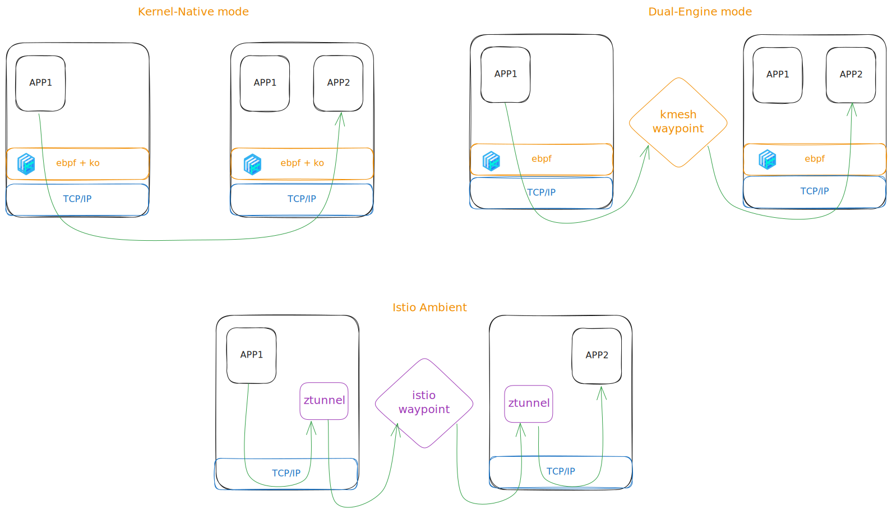

From the above picture, we can see that kmesh support two working modes:

1. Kernel-Native mode: it makes use of ebpf and kernel module to do both L4 and L7 traffic management, this is offloading all the manaement to kernel. And we can see no connection termination at all. 

2. Dual-Engine mode: it makes use of ebpf to do L4 traffic routing and loadbalancing, and there is a waypoint, which can be deployed anywhere to do L7 taffic management. Actually the `kmesh-waypoint` is also based on envoy and we developed a new filter to communicate with ebpf program. 

And for the istio ambient:

3. It is using a userspace proxy `ztunnel` to do L4 traffic management and a L7 proxy `waypoint` to do L7 traffic management. 

So the conclusion should be clear now:

- Kmesh `Kernel-Native` mode is totally different with ambient. 

- Kmesh `Dual-Engine` mode has something similar with ambient mesh in that both has a waypoint based on envoy. We believe using a namespace/service scoped L7 proxy can better isolate fault and reduce resource overload, so we recognize this arch too. But the first diffrence here is we kmesh are using ebpf progs attached to hook points like cgroup/connect, sockops, xdp, etc to redirect traffic to remote `kmesh-waypoint`, while ambient mesh using iptables and userspace `ztunnel` to redirect to `istio-waypoint`. Secondly, the kmesh-waypoint communicate with ebpf prog with a diffrent protocol compared with istio `HBONE`. 